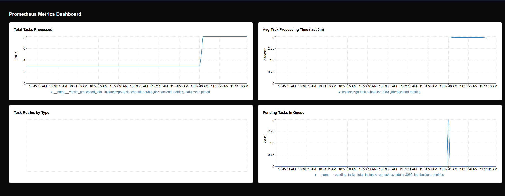

# Distributed Task Scheduler

## Overview
The **Distributed Task Scheduler** is a scalable and fault-tolerant system designed to schedule and execute tasks efficiently in a distributed environment. It is deployed on **AWS EC2** using **Kafka, Redis, PostgreSQL, Elasticsearch, Prometheus, Grafana, WebSockets**, and **Kubernetes**.

### **Features**
- **Task Scheduling & Execution**: Priority-based execution with retry mechanisms.
- **Real-time Logs & Events**: Uses **WebSockets** for real-time logging and **Kafka** for event-driven processing.
- **Monitoring & Metrics**: Integrated with **Prometheus, Grafana, and Elasticsearch**.
- **Persistence & Caching**: **PostgreSQL** for persistence, **Redis** for caching.
- **Scalable & Fault Tolerant**: Deployed on **AWS EC2** using **Kubernetes**.
- **Automated CI/CD Pipeline**: Docker images and Helm charts are pushed to **Docker Hub** and deployed automatically on each release.

## **Architecture**
The system consists of the following services:

### 1. **API Gateway**
- Routes incoming requests.
- Provides **WebSocket** endpoint for real-time logging.

### 2. **Scheduler Service**
- Manages task scheduling & prioritization.
- Handles retries and failure recovery.

### 3. **Worker Service**
- Polls for pending tasks and executes them.
- Publishes Kafka events on task completion/failure.

### 4. **Monitoring Service**

- Uses **Prometheus & Grafana** for system health and task metrics.
- **Elasticsearch** for logging and analytics.

### 5. **Storage Service**
- **PostgreSQL** for persistent task storage.
- **Redis** for caching pending task counts.
- **Elasticsearch & Kibana** for log search & analytics.

### 6. **UI Service**
- A web-based interface for managing and monitoring scheduled tasks.
- Built with **React** and WebSockets for real-time updates.

---

## **Deployment**
This project is **hosted on AWS EC2** and deployed using **Kubernetes** with **Helm charts** and **Kubernetes manifests**.

### **Setup & Deployment Commands**
The system is managed using a **Makefile** for easy execution of commands.

#### **1. Build & Run Locally (Docker Compose)**
```sh
make build
make run
```

#### **2. Deploy to Kubernetes**
```sh
make k8s-deploy
```

#### **3. Install Helm Chart**
```sh
make helm-install
```

#### **4. Monitor System Metrics**
```sh
make monitor
```

#### **5. Push Docker Image & Helm Chart on Release**
```sh
make release
```

#### **6. Clean Up**
```sh
make clean
```
---

This system is built for **high scalability, fault tolerance, and real-time task execution**, making it ideal for distributed computing environments. 🚀

